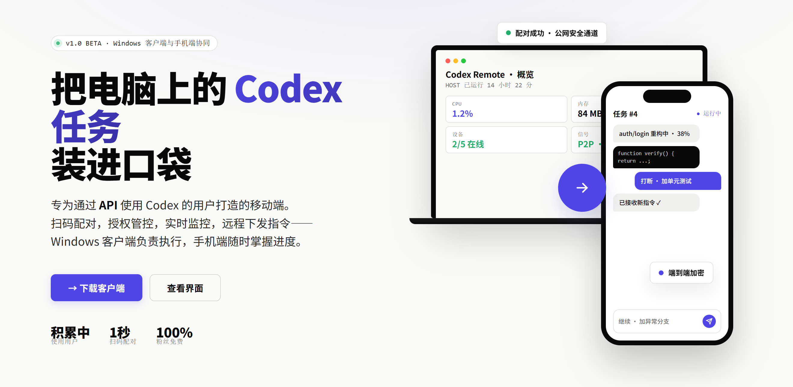

# Codex Remote



**把电脑上的 Codex 任务装进口袋。**

Codex Remote 是一个开源的远程桥接项目：让你在 Android 手机上查看 Windows 电脑上的 Codex Desktop 会话，并在获得授权后远程发送指令。Windows 客户端采用 Electron，本机运行 .NET Host；手机端通过 HTTPS、WebSocket 信令和 WebRTC 建立安全连接。

## 你可以用它做什么

- **实时查看**：浏览已授权项目、会话、消息和执行状态。
- **远程发送**：使用真实 thread UUID 向指定会话提交纯文本指令。
- **扫码配对**：通过设备身份和签名信令完成公网安全配对。
- **按需读取**：附件和大事件分块传输，避免一次性加载过多内容。
- **权限控制**：免费设备只读，发送能力由服务端签发授权控制。

## 项目组成

- `src/CodexBridge.Desktop`：Electron Windows 客户端。
- `src/CodexBridge.Host`、`src/CodexBridge.Windows`：本机 Host 与 Codex 数据集成。
- `src/CodexBridge.Signal`、`src/CodexBridge.Transport`：信令与 WebRTC 传输。
- `src/CodexBridge.Entitlement.Server`：可选的账号与授权 API。
- `android/`：Android 客户端。
- `tests/`：.NET、Go 以及浏览器端测试。

## 下载

安装包和 APK 请前往 GitHub **Releases** 页面下载。推荐使用 Electron Windows 安装包和 Android APK，并在安装前核对 Release 中提供的 SHA-256。

## 直接使用博主部署的服务

本项目支持自行部署。如果你不想自己准备服务器，而是希望直接使用博主已经部署的服务，请添加微信获取激活码：


二维码仅用于联系和获取激活码，请勿将激活码、账号密码或设备私钥发布到公开 Issue。

## 开发环境

需要安装：.NET 8 SDK、Node.js/npm、Go，以及 Android 开发所需的 Android SDK。Electron 客户端和 Windows 集成需要 Windows 系统。

```powershell
dotnet restore CodexBridge.sln
dotnet test CodexBridge.sln --no-restore
node --check src/CodexBridge.Desktop/main/index.js
node --check src/CodexBridge.Desktop/renderer/app.js
```

安全脚本使用 fake sender 和隔离状态进行测试。请勿将测试指向真实 Codex 会话。

## 自建服务

请阅读 [部署说明](docs/deployment.md)。该文档只描述通用部署方式，不包含任何真实生产基础设施或凭据。部署者必须通过私有配置提供所有环境参数。

## 安全问题

请不要在公开 Issue 中报告安全漏洞。请通过仓库维护者提供的私密渠道报告，并且不要附带凭据或生产日志。

## 许可证

本项目采用 [Apache License 2.0](LICENSE) 开源。
